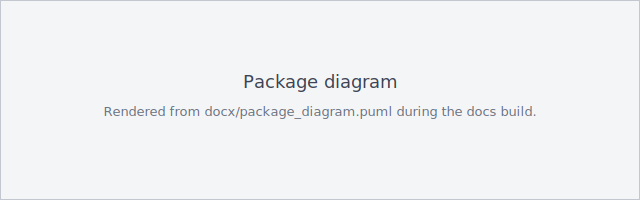
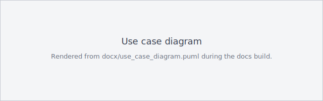
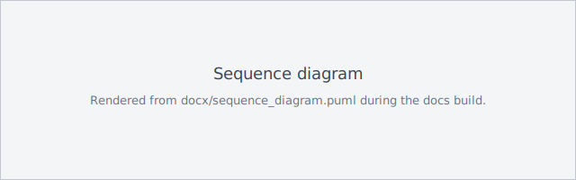

# Architecture

The library is a namespace package (`rl_card_lib`) assembled from five
distributions that layer on a game-agnostic core. The diagrams below are
rendered from the PlantUML sources in
[`docx/`](https://github.com/mkh63d/rl-card-lib/tree/main/docx) during the docs
build; edit the `.puml` files to change them.

## Package diagram

The modular structure of the library — how the packages depend on each other and
what each one contains.

- **cardgames** — `Card`, `Deck`, `Player`, `CardGame` and the reusable `rules` helpers.
- **core** — the `Game` base class, the Gym wrapper, and a minimal standalone trainer.
- **agents** — three families: baselines (`RandomAgent`, `HeuristicAgent`, `GreedyLookaheadAgent`), search (`MCTSAgent`), and learners (`QLearningAgent`, `DQNAgent`, `DoubleDQNAgent`, `PPOAgent`) with their network and replay-buffer components.
- **env** — the Gymnasium-like wrappers (`CardGameEnv`, `MaskedCardGameEnv`).
- **trainer** — the training loop, the self-play trainer with a frozen opponent snapshot, and metrics tracking.
- **games** — the concrete games (Klondike, Macao), the Klondike solvability search, and the per-game heuristic agents.
- **harness** — the one definition of the sweep-registration API, evaluation protocols and baseline sets that the scripts import.
- **report** — `TrainingReport`, `RunRecord` / `RunStore`, and the self-contained `HtmlReport`.
- **utils** / **visualizer** — encoding helpers and text rendering.

[{ loading=lazy }](assets/diagrams/package_diagram.svg)

## Use-case diagram

The main use cases for the three actors the library serves.

- **Developer / Researcher** — create custom games and env wrappers, reuse the rule helpers, analyse Klondike solvability, and register a game for the sweep.
- **ML Engineer** — build agents from all three families, train, evaluate, benchmark, self-play, run the full training sweep and generate the HTML report.
- **Game Designer** — implement and test game rules and visualizations.

[{ loading=lazy }](assets/diagrams/use_case_diagram.svg)

## Sequence diagram

The DQN training workflow end to end: initialization, per-episode `agent.reset()`
(where epsilon decays once per episode), the episode loop with masked
exploitation, the optional self-play path (a frozen opponent snapshot refreshed
every `opponent_update_interval` episodes), environment stepping, experience
replay and target-network updates, then metrics, evaluation and checkpointing.

[{ loading=lazy }](assets/diagrams/sequence_diagram.svg)
